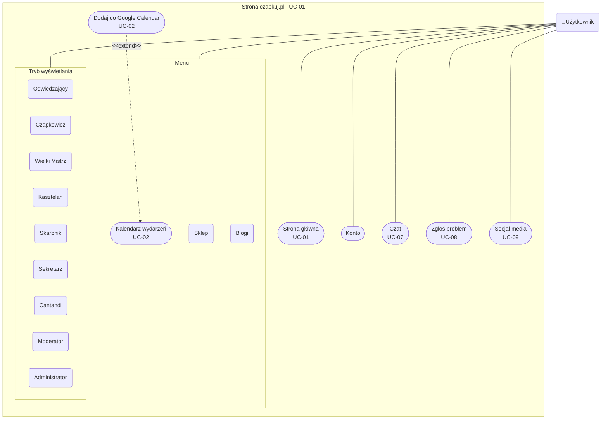

# Diagramy przypadków użycia

---

## Ogólnodostępne funkcje strony

---

### UCD-STR-1

**UC-01: Przeglądanie strony głównej i nawigacja**
* STR-FR-001 – System musi umożliwiać wyświetlenie strony głównej z opisem serwisu i trybem użytkownika.
* STR-FR-002 – System musi umożliwiać przełączanie trybu widoku (np. „Odwiedzający”, „Czapkowicz”).
* STR-FR-003 – System musi udostępniać menu hamburgerowe prowadzące do podstron serwisu.
* STR-FR-004 – System musi umożliwiać nawigację do modułu „Kalendarz wydarzeń” z poziomu menu.
* STR-FR-007 – System musi umożliwiać dostęp do sekcji „Sklep” z trzema opcjami zamówień z poziomu menu.
* STR-FR-035 – System musi przekierowywać użytkownika do odpowiednich modułów zgodnie z rolą i statusem konta.

